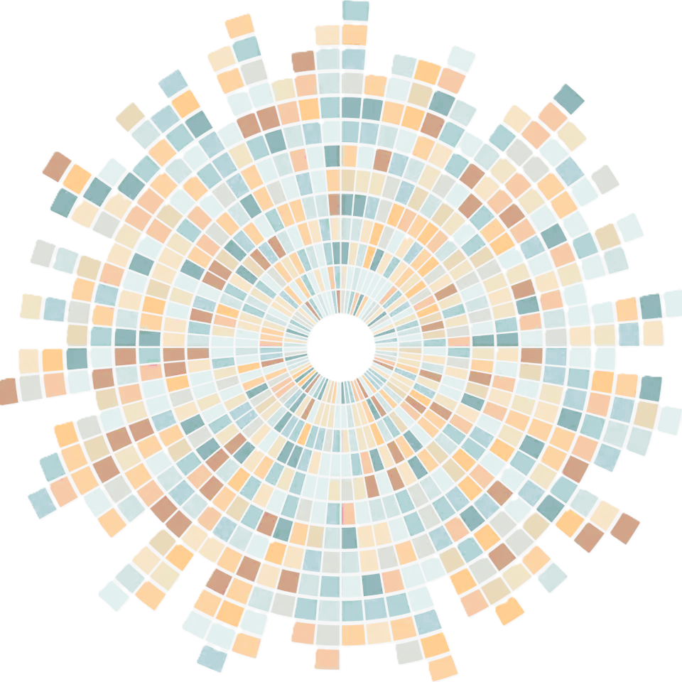

::: hero
::: hero-text
# Núria Moragas
::: subtitle
Bioinformatics Scientist · NGS · Multi-omics Data Science
:::

::: bio
PhD-trained bioinformatician with extensive experience in NGS data analysis, epigenomics, and multi-omics integration for translational biomedical research. I develop reproducible and automated pipelines in R and Python to process large-scale genomic and epigenetic datasets, with a focus on biomarker discovery and machine learning for cancer research.

Currently at **IDIBELL** (Oncology Data Analytics Program), Barcelona.
[Learn more about me &rarr;](/about.qmd){.about-links .subtitle}
:::

<a href="publications.qmd" class="btn-primary-custom">Publications</a>
<a href="cv.qmd" class="btn-outline-custom">Download CV</a>
:::

::: hero-photo
{alt="circo_plot"}
:::
:::

 

